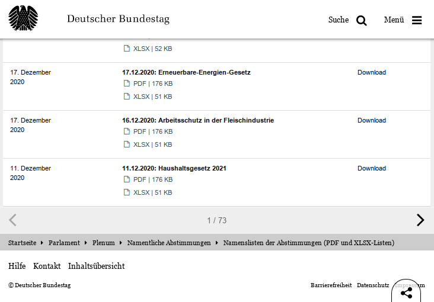
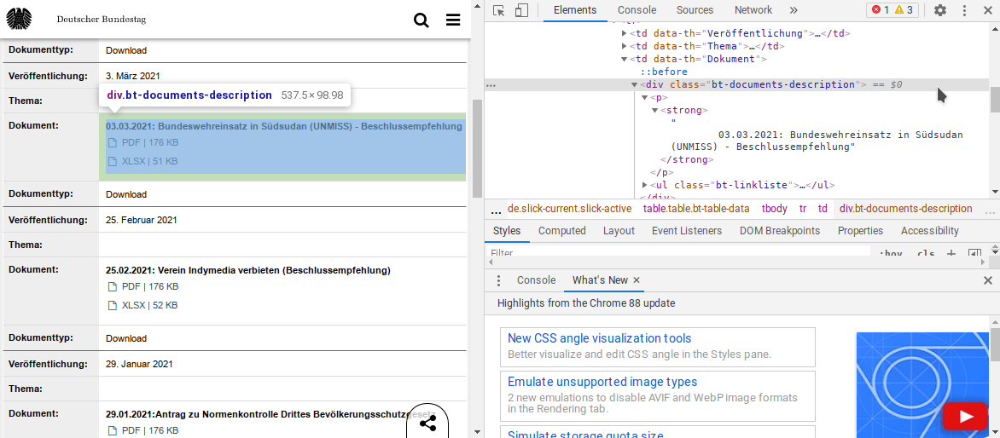

```{r setup, include=FALSE}
knitr::opts_chunk$set(echo = FALSE, 
                      collapse = TRUE,
                      comment = "#>",
                      fig.retina = 2, # Control using dpi
                      fig.width = 6,  # generated images
                      fig.align = "center",
                      dpi = 72, 
                      out.width = "100%",
                      dev = "svg",
                      dev.args = list(png = list(type = "cairo-png")),
                      optipng = "-o1 -quiet")
source("../../resources/jolly_theme.R", local = knitr::knit_global())
library("reticulate")
use_condaenv(condaenv = "r-reticulate")
library("r2symbols")
```


## Introduction
**Note:** *I found a far better way to obtain all of the available ~700 datasets. The process can be found in [Part II.1](https://jollydata.blog/posts/2021-03-22-bundestag-part-ii1/) of this series. I will continue the series with the data obtained in that improved post, but will leave this version online for educational reasons, though.*

This is the second part of a series on the German national parliament (aka "Bundestag"). In the [first part](https://jollydata.blog/posts/2021-03-07-bundestag-part-i/) I looked at the historical data on the parliamentarians. In further posts of this series I want to take a look at the voting behaviour of the parlamentarians, at least at those votes where the names are registered publicly. For this I need to collect this polling data, which will be this blog post.

```{r, layout="l-body",fig.cap="List of polls in the Bundestag (https://www.bundestag.de/parlament/plenum/abstimmung/liste), screenshot taken 14.03.2021."}

```


The Bundestag [provides polling data](https://www.bundestag.de/parlament/plenum/abstimmung/liste) for quite a long time going back as PDF reports, but only since around 2012 in machine readable tables. They do so on a website that lists the datasets with title of the poll and a download link for PDF and XLS(X) files (s. Figure 1). Unfortunately there is no specific license mentioned for the open data, but the data is offered to "interested users" for "further machine processing". Sounds good enough for my use.
As I couldn't find an API to access this data, I had to fall back to web scraping.

<aside>In this post I will not include any analysis of the data, as the process of data collection is sufficiently long. If you're not interested in this, I invite you to come back for the next part of the series.</aside>

*Preview Image: "Harvester", `r symbol("copyright")` `r format(Sys.time(), "%Y")` Christian A. Gebhard*

## Downloading the data files

### Analysing the Website
I first tried to use a simple script with only the `requests` package and `beautiful soup`.
As this failed (no datasets found in the requested html), I realized, that the list of polls is not static html, but is dynamically created via Java Script, whenever a user opens the page.

Therefore I had to go back and learn about web scraping of dynamic sites. There are several options here. As I'm doing this post in python, I chose [selenium](https://www.selenium.dev), but there are other options such as [Scrapy](https://scrapy.org)

The `selenium` package provides a "web driver" that directs a browser of choice^[Google Chrome in my case]. This way it is possible to perform repetitive tasks on a dynamic page (e.g. clicking "next page"), let the scripts load the content of interest and then scrape these from the dynamic html.

```{r, layout="l-page",fig.cap="Analysing the website of the Bundestag (https://www.bundestag.de/parlament/plenum/abstimmung/liste) with the dev tools, screenshot taken 14.03.2021."}

```


Using the dev-tools of my browser I looked up the names of the html objects I needed to access to obtain the data of interest. (s. Figure 2)


### Collecting the URLs for the datasets of interest

In this first section I scraped the (static) download URLs for the Excel files from the dynamic list, as described above. As I commented all major steps in the code chunks below, I will not write redundant details in the text.

First all necessary python modules are loaded and some options are set.

```{python libraries, eval=FALSE, echo=TRUE}
# import selenium's webdriver and set options
from selenium import webdriver
options = webdriver.ChromeOptions()
options.add_argument('--ignore-certificate-errors')
options.add_argument('--incognito')

# Import all other libraries needed for the following steps
import requests # for the actual downloads
import time # to force pauses in the script
import pandas as pd # to handle the collected data
import glob # to read all the downloaded files automatically
import re # for regular expressions
from datetime import datetime # to handle date variables
```


The next step is the collection of the download URLs. As seen in Figure 1, there are 73 pages of the list to click through. I hardcoded this number into the script below. However the script got quite slow after ~25 pages and I stopped it, when I realized, that no new URLs were added despite the script still going through the table.

<aside>I didn't do a complete "post mortem", why the script got ever slower, but this way I learned that the xls(x) files are only accessible back until October 18th 2012.</aside>

Another adaption to the script was necessary, as the dynamic html not only contained the table items/rows of the page that was currently viewed, but also all items from the previous pages. This resulted in the first draft of the script cycling over an ever growing number of rows with each new page. In the below version, the last number of rows are skipped, so that only the new items are scraped. 

```{python Collect URLs, eval=FALSE, echo=TRUE}
# setting up the driver with the above options
driver = webdriver.Chrome("/usr/lib/chromedriver_dir/chromedriver", chrome_options=options)

# set a timer for the script to wait until an element to be found, or a command is completed.
driver.implicitly_wait(15)

# open the website and wait for 10s to fully load the site
driver.get("https://www.bundestag.de/parlament/plenum/abstimmung/liste")
time.sleep(10)

# instantiate an empty list to store the URLs
url_df = pd.DataFrame(columns = ['name', 'url'])

# instantiate a skipping variable to fix repeating table rows.
skip_n = 0

# Outer loop to go through all pages of the dynamic table on the website.
# For now this is hard-coded to 73 pages as seen on the website (s. Figure 1)
for i in range(73):
  
  # print progress
  print("Working on page " + str(i + 1) + ":")
  
  # find all target elements (name and urls of files) from the dynamic list
  datasets = driver.find_elements_by_class_name("bt-documents-description")

  # if the website is empty or wasn't read correctly, stop the loop.
  if len(datasets) == 0:
    print("No dataset links found on this page - Stopping.")
    break
  
  # otherwise continue the scraping
  else:
    print(str(len(datasets)) + " datasets found, skipping " + str(skip_n) + ", - processing...")
    
    # inner loop to go through all elements from the current page
    for j in range(skip_n, len(datasets)):
      
      # extract the title only (i.e. the bold text, not the link texts for the urls)
      item_name = datasets[j].find_element_by_tag_name("strong").text
      if item_name == "":
        print("Skipping empty item.")
        continue
      
      # retrieve sub-elements (document urls) from the item
      elements = datasets[j].find_elements_by_class_name("bt-link-dokument")

      # loop through sub-elements (i.e. pdf and xlsx-links)
      for elem in elements:
        
        # extract the url from the element
        element_url = elem.get_attribute("href")

        # only store the URL, if it points to an excel sheet
        if element_url.endswith(".xlsx") or element_url.endswith(".xls"):
          
          item_url = element_url
          
          # store name and url in a dict and append to dataframe
          item_dict = {"name" : item_name, "url" : item_url}
          url_df = url_df.append(item_dict, ignore_index = True)

    print("This page is complete, scrolling down and going to the next page")
    
    # scroll down the website, since otherwise the "share" button overlays 
    # the "next-button" which throws an exception and stops the script
    try:
      js = 'window.scrollTo(0, document.documentElement.scrollHeight)'
      driver.execute_script(js)
      print("Scrolled...")
      time.sleep(2) # give time to scoll
    except:
      print("Scrolling failed")
      break
    
  
    # find and click the button to the next page:
    try:
      python_button = driver.find_element_by_class_name('slick-next.slick-arrow')
      python_button.click()
    except:
      print("Clicking failed")
      driver.quit()
      break
    finally:
      # pause for 20 seconds before next loop to avoid jamming the website.
      print("Waiting politely for 20 seconds")
      time.sleep(20)
      
      # store current length of the datasets table to skip these lines in the next loop.
      skip_n = len(datasets)

# after all pages are scraped, quit connection
print("All done, quitting connection")
driver.quit()

# write url_list to file
url_df.to_csv("url_df.csv")

```

The above script not only scrapes the URLs to the Excel files, but also the name and date of the poll. I want to include both in the final dataset.

### Download the datasets

After compiling the dataframe with the names and URLs, the following script can go through it and download one file at a time. To prevent jamming of the website I forced some seconds of pauses in each loop of the script.

```{python, eval=FALSE, echo=TRUE}

# read the previously saved data frame
working_df = pd.read_csv("url_df.csv", index_col = 0)

# define the characters to remove from the dataset names later
special_chars = ['.', ':', '(', ")", "/", ","]

# iterate over the rows of the dataframe
for i, row in working_df.iterrows():
  
  # first try to download the file via requests library
  try:
    response = requests.get(row['url'])
    
  except:
    print("Download of file index " + str(i) + " failed, exiting loop.")
    break
  
  else:
    # if successfull, determine the filetype of the downloaded file  
    if row['url'].endswith(".xlsx"):
      file_type = ".xlsx"
    else:
      file_type = ".xls"
      
    # compose the path/filename, remove unwanted characters and add filetype.
    filename = 'downloaded/' + ''.join(c for c in row['name'] if not c in special_chars) + file_type
    # replace space with underscores
    filename = filename.replace(" ", "_")

    # open the output file and write the downloaded content
    with open(filename, "wb") as file:
      file.write(response.content)
      
    print("File " + str(i) + " downloaded.")
    
    # wait 12s before the net iteration to not jam the website
    time.sleep(12)
```

Including the intermittant breaks, the download period spanned almost 2 hours.

## Processing and combining the data

I noticed some problems in the scraped date and poll-name data (and thus the filenames), that would propagate through the process and later cause problems. After looking up the few needed bits of information, I manually corrected the names of some files:

```
From: 2804206_Beschlussempfehlung_zum_Verbot_von_Fracking_in_Deutschland.xls 
to:   28042016_Beschlussempfehlung_zum_Verbot_von_Fracking_in_Deutschland.xls

From: Bundeswehreinsatz_ACTIVE_ENDEAVOUR_OAE.xls
to:   18122014_Bundeswehreinsatz_ACTIVE_ENDEAVOUR_OAE.xls

From: Bundeswehreinsatz_in_Afghanistan_RSM.xls 
to:   18122014_Bundeswehreinsatz_in_Afghanistan_RSM.xls

From: Änderung_des_Bundesdatenschutzgesetzes.xls
to:   18122014_Änderung_des_Bundesdatenschutzgesetzes.xls

From: Änderung_des_Bundesdatenschutzgesetzes_-_Änderungsantrag.xls
to:   18122014_Änderung_des_Bundesdatenschutzgesetzes_-_Änderungsantrag.xls

From: 270620130_Antrag_Bündnis_90__Die_Grünen_-_Entwurf_eines_Gesetzes...xls
to:   27062013_Antrag_Bündnis_90__Die_Grünen_-_Entwurf_eines_Gesetzes...xls

From: 29012021Antrag_zu_Normenkontrolle_Drittes_Bevölkerungsschutzgesetz.xlsx 
to:   29012021_Antrag_zu_Normenkontrolle_Drittes_Bevölkerungsschutzgesetz.xlsx
```

### Assembling the datasets

After downloading all files, I concatenated them into one single dataframe to facilitate later analyses. In the same process I added the date and title of the polls (that were intermittently stored in the file names) into the dataframe.

```{python eval=FALSE, echo=TRUE}

# find all downloaded Excel files (xls and xlsx)
file_list = glob.glob("downloaded/*.xls*")
print("Files found: " + len(file_list)

#define file-type pattern
pattern = r'\.xlsx?$'

# initialize empty df
df = pd.DataFrame()

# define vars for process checks
processed = 0
failed = 0

# loop over all found files in downloaded/ directory
for f in range(len(file_list)):
  
  # read the dataset txo a temporary df
  try:
    temporary_df = pd.read_excel(file_list[f])
  except:
    print("not read: " + file_list[f])
    failed = failed + 1
    continue
  finally:
    processed = processed +1
  

  # extract the title of the poll and the date from the filename.
  # Step 1: remove the folder name
  step1 = file_list[f].replace("downloaded/", "", 1)
  
  # Step 2: remove file extension via Regular Expression to catch xlsx and xls
  step2 = re.sub(pattern, '', step1)
  # print(step2)
  
  # Step 3: split into date and title
  date, title = step2.split("_", 1)

  # convert date to a datetime type and add to temporary df
  date = datetime.strptime(date, "%d%m%Y")
  temporary_df['date'] = date
  
  # replace underscores from filename to get a proper title of the poll
  title = title.replace("_", " ")
  temporary_df['title'] = title
  
  # add temporary dataframe to the cumulated df
  df = pd.concat([df, temporary_df], axis=0, ignore_index = True)
  
  
# print checks and parts of dataframe for quality check
print("Processed: " + str(processed))
print("Failed: " + str(failed))
print(df.shape)
print(df.head())
print(df.tail())

# check if number of poll matches the number of files read
df.drop_duplicates(subset=['Wahlperiode', 'Sitzungnr', 'Abstimmnr'])


# save df to file
df.to_csv("data_complete.csv")

```


## Summary and Outlook

This concludes the web scraping. The resulting dataframe has 316044 rows, containing the data of 477 separate polls with the individual votes of all participating representatives. The votes span a period of three electoral periods (2012 until 2021).

As there is no license specified for the Open Data of the Bundestag I cannot share the scraped data.

I don't know whether the data is collected by the institution in a standardized way or if typos, abbreviations or other inconsistencies need to be accounted for. In the above process I haven't seen any problems of the sort, but there are > 300k lines, that I haven't checked explicitly. Another aspect is, that names of representatives might have changed over time due to marriage or divorce, titles might been earned (or lost).

The most robust way would be, to use a representative-ID as unique identifier in the further analysis. These IDs and all official name changes are also available in the open data from the Bundestag. In fact I have used this data in the [first part](https://jollydata.blog/posts/2021-03-07-bundestag-part-i/) of this series, however, there I chose to only use the current/last known name.

I plan to use "fuzzy" (string distance) joining, to unify the representatives in the polling data using the dataset with the historical data on the representatives. This will be the next part of the series, so stay tuned!