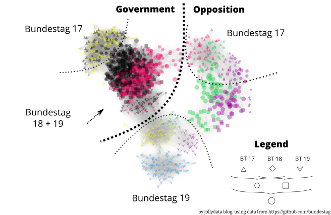

```{r setup, include=FALSE}
knitr::opts_chunk$set(echo = FALSE, 
                      collapse = FALSE,
                      comment = "#>",
                      fig.retina = 2, # Control using dpi
                      fig.width = 6,  # generated images
                      fig.align = "center",
                      dpi = 72, 
                      out.width = "100%",
                      dev = "png",
                      dev.args = list(png = list(type = "cairo-png")),
                      optipng = "-o1 -quiet")

xaringanExtra::use_panelset()

source("../../resources/jolly_theme.R", local = knitr::knit_global())
library("r2symbols")
```

> **Updated 2021-09-20:** minor text refinements, added comment section

## Introduction

This is the third part of the series on the german national parliament, the *Bundestag*. In the previous parts, I got an exploratory feeling for the available open data ([Part I](https://jollydata.blog/posts/2021-03-07-bundestag-part-i/)) and collected more data on the votes / polls in the parliament ([Part II.1](https://jollydata.blog/posts/2021-03-22-bundestag-part-ii1/))^[You can also check out [Part II](https://jollydata.blog/posts/2021-03-14-bundestag-part-ii-web-scraping-the-roll-call-votes/), but I did not use the data collected there. I keep that blog post for reference, but use the data collected and prepared in [Part II.1](https://jollydata.blog/posts/2021-03-22-bundestag-part-ii1/)].

In this part, I want to explore the voting behaviour of the deputies across all available datasets, spanning three legislative periods from 2009 until now. Sounds great, doesn't it? Well...I knew what I wanted quite early, but getting there took much more time and effort, than expected and I had to tackle challenges I did not foresee before starting this post. If you're interested in them I'll give a summary below, but I plan a whole "below deck" post with all that I learned in the process. This way I can focus on the results here. As always, you can jump to [Conclusions] right away.

 **Note:** *As (for me) this is the first network analysis project of this size, I cannot guarantee, that the underlying data is represented/handled correctly by the code. I wrote the post with best intentions, with no desire to influence anyone's opinion for the upcoming election. Please take it as what it is: an experimental approach to a new technology by a non-professional. If you find any issues with the code or find anything else, that is not right, please do let me know!*

::::: {.panelset}

::: {.panel}
[The Ugly]{.panel-name}

There's one huge problem with the voting data: a lot of implicitly missing data. Some deputies replaced colleagues, that left the parliament short before the next elections, due to personal or other reasons. Some of these replacement-deputies voted in only one or two polls, which means they have more than 600 implicitly missing votes. 

But even if I'd exclude these few extreme "outliers" a large portion of the deputies only served in one or two of the three legislative periods. In fact, only about a quarter of them was present in all three periods (s. Figure 1). This makes unsupervised learning difficult at least. Also, I'm not aware of practicable methods to perform clustering on barely categorical data such as the votes "yes", "no" or "abstention".^[I could have dummy-coded / one-hot-encoded the vote categories, but that would have resulted in way more features than deputies, which seemed strange. I might reconsider this in the future...]

Sure, I could have split the dataset into the separate legislative periods and continue from there. But I wanted to get a sense of "longitudinal clusters" and maybe even compare parlamentarians that served at different times. So I had to find another way: A network analysis.
:::


::: {.panel}
[The Bad]{.panel-name}

I'm doing the analysis on a midrange 2013 notebook with 8GB of RAM. Building a network is quite straight forward using specialized libraries such as `{igraph}` for R or `{networkx}` in Python. They offer a lot of possibilities. However, the bad thing is the size of the graph I intended to build. At some point I had to juggle 72 million edges between the nodes. The R session frequently hit the boundaries of my memory^[and crashed] more often than I expected, even though I tried many different approaches.

I even tried to rent powerful RStudio servers on *AWS* and *Google Cloud Platform*, but didn't succeed either, as the code was pretty inefficient in the beginning and probably did not leverage the vast computing power and memory on these servers.

I plan to make a piece on my lessons in a separate post.
:::

::: {.panel}
[The Good]{.panel-name}

After many iterations and improvements, setbacks and redesigns I found a way to juggle the data on my limited hardware: I performed the construction of the graph object and the similarity analysis between the deputies in R with `{igraph}` and then switched to the specialized software [**Cytoscape**](https://cytoscape.org) for layouting and plotting the network:

> "Cytoscape is an open source software platform for visualizing molecular interaction networks and biological pathways and integrating these networks with annotations, gene expression profiles and other state data. Although Cytoscape was originally designed for biological research, now it is a general platform for complex network analysis and visualization. "
> `r tufte::quote_footer('--- https://cytoscape.org/what_is_cytoscape.html')`

As this Java software was designed to handle extremely large networks, it managed the voting data quite well. Cytoscape comprises many additional plugins or apps for special cases. I only used some of the basic functions of but still enjoyed playing around with the different layout algorithms and tweak the visualizations.

For this analysis I used Cytoscape version 3.8.2, running on Java 11.0.11.

:::


::: {.panel}
[The data]{.panel-name}

The Bundestag [provides polling data](https://www.bundestag.de/parlament/plenum/abstimmung/liste) for quite a long time going back as PDF reports, but only since around 2010 in machine readable tables. Roll call data since 2009 is available as lists that can be scraped from the website. Unfortunately there is no specific license mentioned for the open data, but the data is offered to "interested users" for "further machine processing". Sounds good enough for my use.

I'll be using the data hosted in a [github repo](https://github.com/bundestag) called "bundestag", which was generated scraping the www.bundestag.de website. Among the different datasets, there are json files with the individual votes linked to the ID number of the ballot and in others there is the meta-data on the ballots including title, date, etc.
Both are unofficial data, but I probably couldn't scrape it in a better quality, so I will continue to use this data.

The data used was published under "The Unlicense" with no conditions whatsoever. **I still want to give credit to the [contributors](https://github.com/orgs/bundestag/people) of this repo and thank them for their great and helpful work!**

To read about how I loaded and prepared this data, please check out [Part II.1](https://jollydata.blog/posts/2021-03-22-bundestag-part-ii1/). 


:::

:::::

## Preparation

A graph object is composed of *nodes*^[another name is *vertex*] and *edges*. Nodes represent entities, that are connected to one another by edges. For a detailed explanation, check out the [Wikipedia article](https://en.wikipedia.org/wiki/Graph_(discrete_mathematics)) on graph theory.  
For this post it is sufficient to say that I intend to make the elected deputies the nodes in my graph. They will be connected to one another, if they share a similar voting behaviour in the available poll data.

### Setup and Loading the data
As I prepared the data beforehand, I can dive into the analysis right away with only minor adjustments and preparations as described in the next section. First, these are the libraries used:

```{r libraries, include=TRUE, echo=TRUE, code_folding=FALSE}
library("tidyverse")
library("rmarkdown")
library("igraph")
```


The data was prepared to a rectangular/tidy form with every vote of each deputy in each poll as a row/observation. Let's load the dataset and inspect it:

```{r reading the data, include=TRUE, echo=TRUE}

# read the data from file
voting_data <- read_csv("../../../data_sources/2021_bundestag/parsed/polls_voting_complete.csv", na = "na") %>%
  mutate(name = name_clean) %>%
  select(-name_clean) 

glimpse(voting_data)
summary(voting_data)
```

There are 427039 single votes listed for 655 polls, ranging from 2009-12-03 to 2021-03-26.

### Preparing the data


As mentioned before, the data spans three legislative periods (LP) divided by the elections / reconstitutions of the parliament at 2013-10-22 and 2017-10-24. The periods are named after the serial number of the respective parliament: Bundestag 17, 18 and 19.  
Although I want to make a longitudinal analysis, I still want to see if the LPs do have an influence on the clustering, so I added them as a feature:

<aside>During coding I frequently used "wp" or "w_period" from the German "Wahlperiode", meaning legislative period.</aside>

```{r splitting the data, include=TRUE, echo=TRUE, code_folding=FALSE}

# split the dataset at the election dates and assign the election period to w_period
voting_data_with_wp <- voting_data %>%
  mutate(
    w_period = cut(
      x = p_date,
      breaks = lubridate::ymd(c("2009-12-03", "2013-10-22", "2017-10-24", "2021-03-26")),
      labels = c("bt17", "bt18", "bt19"),
      include.lowest = TRUE
    )
  )

# check success / correct splitting
voting_data_with_wp %>% 
  group_by(w_period) %>% 
  summarise(min_date = min(p_date), max_date = max(p_date))

# check the data
head(voting_data_with_wp) %>% paged_table()
```

For the planned graph I need to extract the edge data (more on that later) and the node/vertex data. The latter is a dataframe containing details on the deputies. Apart from the name, the party and the state further data is added: the number of active periods and a factor-column encoding in which period(s) a deputy served.

```{r, include=TRUE, echo=TRUE, fig.cap="Distribution of the number of active legislative periods of all deputies."}
# select the data of interest
voting_data_completed <- voting_data %>%
  select(name, vote, p_id) %>%
  arrange(p_id, name)

# select the deputy info of interest
deputies <- voting_data_with_wp %>% 
  distinct(name, w_period, .keep_all = TRUE) %>%
  select(name, party, state, w_period) 

# count the number of electoral periods in which a deputy was listed
deputies_wps <- deputies %>% 
  count(name) %>% 
  rename(n_wp = n)

# the deputies are further grouped according to the periods in which they served.
# by calculating the mean of their respective active periods.
deputies_wpclust <- deputies %>% 
    mutate(
    wp_num = as.numeric(str_remove(w_period, "^bt"))
    ) %>% 
  group_by(name) %>% 
  summarise(wp_clust = mean(wp_num))

ggplot(deputies_wps, aes(n_wp)) +
  geom_histogram(bins = 3, fill = jolly_petrol) +
  scale_x_continuous(breaks = c(1, 2, 3), labels = c("1", "2", "3"))+
  labs(
    title = "How many legislative periods did the deputies serve?",
    subtitle = "Number of deputies voting for at least one poll in one, two or three legisl. periods.",
    x = "Legislative periods",
    y = "Number of deputies",
    caption = "by jollydata.blog\nusing data from https://github.com/bundestag"
  ) +
  jolly_theme()
  
deputies_complete <- deputies %>% 
  left_join(deputies_wps, by = "name") %>% 
  left_join(deputies_wpclust, by = "name") %>% 
  mutate(
    wp_clust_fct = ifelse(n_wp == 3, "all_wp", as.character(wp_clust))
  )

deputies_distinct <- deputies_complete %>% 
  distinct(name, .keep_all = TRUE)

```


<!-- I then still split the data, even though I did not use the separate sets in the end. -->


## Building the network
As mentioned before, I chose a network analysis as approach to cluster the representatives according to their voting behaviour. The process includes three core functions written in R and the later visualiziation in cytoscape.

::::: {.panelset}

::: {.panel}

### The Logic {.panel-name}


I posted the code in all detail in the next tab. The logic of the whole process goes as such:

1. In the `compose_graph`-function the votes dataframe is nested under the poll ID, i.e. for each poll ID there is a "sub-dataframe" containing the name of the deputy and her/his vote in that poll. Using `purrr::map()` each nested dataframe is passed to the `build_graph_dataframe` function.
3. In `build_graph_dataframe` the votes of all $N$ deputies in the received poll data are compared to one another, creating a $N\times N$ matrix, where TRUE means "voted the same" and FALSE means "voted differently". This boolean matrix is coerced into a numerical matrix of 0s and 1s and interpreted as adjacency matrix of a graph object, which is then converted to an edgelist. This edgelist-dataframe is returned to `compose_graph`.
3. There, the now nested edgelists are unnested resulting in one huge edgelist (>70 Million edges). This list is a representation of a *multi-graph*, where deputies can be linked to each other by multiple edges (one for each poll, in which they voted the same). Basically, deputies who voted similarly over the time of their career share more common edges.
4. The multi-edges are then simplified as single, but weighted edges, where the weight is the number of the previously multiple edges connecting two nodes.
5. The `export_to_cytoscape` function takes several agruments. By default it converts the edgelist to an adjacency matrix (containing the weights of the edges). Calling `cor()` calculates a correlation- or similarity-matrix from the adjacency matrix. 
In layman's terms, this compares, how mathematically similar^[on a scale from -1: completely different to 1: identical] each deputy is to the voting behaviour of all other representatives.  
In technical terms, the resulting correlation matrix contains Pearson's r for the weights in each column^[= deputy]. More specific, the correlation is high, if two deputies share similarly weighted edges to common "neighbours".
6. `export_to_cytoscape` filters the values to a given threshold (default is $r >= 0.5$) and reconstructs a now similarity-weighted edgelist, containing only edges between representatives, whose voting correlated with an r of at least 0.5. This filtered edgelist is then exported for use in Cytoscape.
7. `export_to_cytoscape` also exports a node-list containing the names and further information on the deputies (state, party affiliation, number of active legislative periods, ...)

:::

::: {.panel}

### The Code {.panel-name}

To keep the blog post short, I collapsed these three functions. Feel free to unfold the code fot the three above mentioned funcions:

```{r graph building function, include=TRUE, echo=TRUE, eval=FALSE}

# this is the central function for the construction of the graph/adjacency function
# it takes a dataframe with name and vote and returns an edgelist for deputies
# that votes the same in this datafram (= one particular poll)
build_graph_dataframe <- function(source_df) {
  
  # pull the votes and construct a named vector
  votes_temp <- pull(source_df, vote)
  names(votes_temp) <- pull(source_df, name)
  
  # apply the comparison of the whole vector to each vector element
  # this returns a boolean matrix object with TRUE, when thwo deputies voted 
  # the same, and FALSE in all other cases (voted differently or one vote is missing)
  # if two deputies were present but abstained from voting this was counted 
  # as equal as well.
  vote_edges_mat <- sapply(votes_temp, function(x) x == votes_temp)
  
  # remove lower triangle (incl. diagonal) of the matrix to prevent duplicated 
  # edges and eigenvectors
  vote_edges_mat[lower.tri(vote_edges_mat, diag = TRUE)] <- NA

  # convert the matrix to a dataframe. Col-/rownames are the deputies' names due
  # to using a named vector above. This results in an edgelist with source- and 
  # target nodes.
  vote_edges_df <- as.data.frame(vote_edges_mat) %>% 
    
    # convert the rownames to a column of source-nodes
    tibble::rownames_to_column("from") %>%
      
    # convert the columns into a column of target-nodes
    pivot_longer(-from, names_to = "to", names_repair = "minimal", values_to = "same_vote") %>%
    
    # only keep the TRUE edges and remove the now obsolete "same_vote" column.
    filter(same_vote == TRUE) %>%
    select(from, to)
  
  # return the edgelist
  return(vote_edges_df)
}

```

```{r graph building procedure, include=TRUE, echo=TRUE, eval=FALSE}
compose_graph <- function(votes_df, deputies_df, slug = "default_slug") {
  # input: 
  # votes_df: a dataframe containing name, vote and p_id columns
  # deputies_df: a df containing name, party and state cols
  # slug: a slug to name all resulting csv files
  
  
  # takes the voting data (name, p_id and vote) and nests it under p_id
  unnested_edgelist <- votes_df %>% 
    group_by(p_id) %>% 
    nest() %>% 
    transmute(edgelists = map(data, build_graph_dataframe)) %>% 
    unnest(edgelists) %>% 
    ungroup() %>% 
    select(-p_id)
  
  print("Edgelist created. Dimensions:")
  print(dim(unnested_edgelist))
  # store the composed edgelist for future quick access.
  filename1 <- paste0(slug, "_allvotes_edgelist.rds")
  saveRDS(unnested_edgelist, file = filename1)
  
  print("Edgelist saved. Building multi edge graph...")
  # construct a graph from the edgelist. This creates multiple edges between
  # most of the deputies (one for each pollin which they voted the same).
  multi_edge_graph <- graph_from_data_frame(unnested_edgelist, directed = FALSE, vertices = deputies_df)
  
  rm(unnested_edgelist)
  # add default weight = 1 to all edges
  E(multi_edge_graph)$weight <- 1

  print("Multigraph created. Moving on to saving it.")
  
  # save progress
  filename2 <- paste0(slug, "_multi_edge_graph.rds")
  saveRDS(multi_edge_graph, filename2)
  print("Multigraph saved. Reducing to weighted edge graph...")


  # combine the attributes (aka weights) using the sum function. Now each node
  # pair is connected by only one edge or none, but the number of same votes is
  # kept as weight for the particular edge.
  voting_graph <- simplify(multi_edge_graph, edge.attr.comb = "sum")
  rm(multi_edge_graph)

  # save progress
  filename3 <- paste0(slug, "_voting_graph.rds")
  saveRDS(voting_graph, filename3)
  print("All saved.")
  
  rm(voting_graph)
}
```


```{r graph export for cytoscape, include=TRUE, echo=TRUE, eval=FALSE}

export_to_cytoscape <- function(g, similarity = TRUE, slug = "default", sim_threshold = 0.7, with_spearman = FALSE) {
  # inputs
  # a graph object g
  # similarity: chooses if the similarity of the deputies should be exported for
  # cytoscape (TRUE, default) or the raw edges representing equal votes (FALSE)
  # slug: prefix for the filenames

  # convert the graph to a dataframe
  cytoscape_export_df <- igraph::as_data_frame(g, what = "both")

  if (similarity == FALSE) {

    # store nodes as nodelist (import as simple csv resulted in errors in cytoscape, so ; is used)
    filename1 <- paste0(slug, "_nodelist.csv")
    cytoscape_export_df$vertices %>%
      write_delim(filename1, delim = ";")

    # store edges as edgelist
    filename2 <- paste0(slug, "_edgelist.csv")
    cytoscape_export_df$edges %>%
      write_delim("edgelist.csv", delim = ";")
  } else {
    # convert graph to adjacency matrix. Directly obtaining a regular/full matrix didn't
    # work, maybe due to memory issues during conversion?
    # So the graph is converted as sparse matrix (keeping the weights as values) and then to a full matrix
    A <- as_adjacency_matrix(g, attr = "weight", sparse = T)
    Af <- as.matrix(A)
    diag(Af) <- 0.001

    if (with_spearman == TRUE) {
      # perform correlation (spearman)
      S <- cor(Af, method = "spearman")
      filename3 <- paste0(slug, "_spearman_", sim_threshold, "nodelist.csv")
      filename4 <- paste0(slug, "_spearman_", sim_threshold, "edgelist.csv")
    } else {
      # perform correlation (pearson)
      S <- cor(Af)
      filename3 <- paste0(slug, "_pearson_", sim_threshold, "nodelist.csv")
      filename4 <- paste0(slug, "_pearson_", sim_threshold, "edgelist.csv")
    }

    # set diagonal to 0
    diag(S) <- 0

    # convert back to graph ("similarity graph")
    sim_graph <- graph_from_adjacency_matrix(S, weighted = TRUE, mode = "undirected")

    # convert graph to dataframe (edgelist including weight column)
    sim_df <- igraph::as_data_frame(sim_graph, what = "edges")

    # filter for edges with a high weight (aka connecting similar deputies) and
    # write to file for later import into cytoscape

    sim_df %>%
      filter(weight > sim_threshold) %>%
      write_delim(filename4, delim = ";")

    nodelist_df <- igraph::as_data_frame(g, what = "vertices")
    nodelist_df %>%
      write_delim(filename3, delim = ";")
  }
}


```


The following code passes the previously prepared data to the above functions.

```{r, include=TRUE, echo=TRUE, eval=FALSE}
# run function for the bt17 data
compose_graph(voting_data_completed, deputies_distinct, slug = "all_wpcluster")

# resulting graph object are stored to "all_wpcluster_voting_graph.rds"
```

```{r, eval=FALSE}
h <- read_rds("all_wpcluster_voting_graph.rds")

export_to_cytoscape(g = h, slug = "all_wpclust", similarity = TRUE, sim_threshold = 0.5, with_spearman = FALSE)
```

:::

:::::

## Visually analysing the network

Finally, the data is in the right shape for a visual representation of the graph!
As mentioned above the software Cytoscape is used. After loading the edges and nodes into the work environment in Cytoscape, the graph layout is computed. For this the "Prefuse Force Dîrected Layout" is used with the addition, that the edge-weights are being respected.


>The force-directed layout is a layout based on the “force-directed” paradigm. This layout is based on the algorithm implemented as part of the prefuse toolkit provided by Jeff Heer. 
> `r tufte::quote_footer('--- https://manual.cytoscape.org/en/3.8.2/Navigation_and_Layout.html?highlight=prefuse')`

The nodes and edges are positioned according to a simulated physical environment, "by assigning forces among the set of edges and the set of nodes, based on their relative positions, and then using these forces either to simulate the motion of the edges and nodes or to minimize their energy"^[For more information on force-directed layouts, there is a [Wikipedia article](https://en.wikipedia.org/wiki/Force-directed_graph_drawing).]

Note that the distances between nodes are not proportional to the mathematical similarity, nor does proximity necessarily mean strong similarity in voting behaviour. The layout algorithm optimizes the node positions by approximation, so clusters are generally tightly interlinked within, but few connections to the next cluster allows the clusters to stay apart. However, keep in mind, that these results are not as accurate, as e.g. clustering algorithms in a PCA.

```{r, echo=FALSE, layout="l-body",fig.cap="A force-directed layout of the parlamentarians of three legislative periods. The deputies are generally clustered into govrernment vs oppositionn. Within these superclusters there is a separation into clusters of deputies active in only one legislative period, while they are connected by deputies serving two or all three periods. Graph created with Cytoscape, using the weighted 'Prefuse Force Dîrected Layout'. Dotted lines were added afterwards to indicate and annotate the clusters. Political parties: CDU/CSU (black), SPD (red), Die Grünen (green), Linke (purple), FDP (yellow), AfD (blue)."}

```

The above image shows a pleasing clustering into party affiliation and legislative periods. For a closer look, here is the [full size version](images/wp_clust_marked.png). A more detailed view, where the nodes have been spread out, so that the representatives' names fit as a label can be found [here](images/wp_clust_detail2.png). The dotted lines are there to indicate "regions" not clear boundaries.

There are a few findings that I want to point out:

- There is a clear overall separation between the governing coalitions and the opposing parties.
- As the *FDP* was governing in BT17, was not elected into BT18 and rejoined the Bundestag in BT19 they are split into two groups connected by only a few deputies, that were present in both LPs.
- The deputies of the opposition are roughly grouped into two distant clusters of deputies serving only in BT17 and BT19. Inbetween they are linked by those representatives who served in two or all three LPs. As they do have common votes with either or both "sides", they connect the BT17 and BT19 clusters nicely.
- The opposition clusters even show a quite distinguishable "longitudinal" clustering, as the two strains of *Die Grünen* and *Die Linke*  do not mix much and run more or less parallel but separate across the three legislative periods. I hoped to see something like that.
- The BT17-Opposition-Cluster also contains the *SPD* deputies that were part of the opposition in BT17. This cluster is linked to the *SPD*-deputies that also served in the governing coalition of BT18.

## Conclusions
The goal of this post was to visually cluster the voting behaviour and compare it to party membership and legislative period.

The results above show, that this was achieved and the plot contains interesting findings both in the overview version (Fig. 2), as well  as in the detailed, labeled version.

After this exploratory visual analysis I want to dive deeper into a more accurate analysis. This will be part of a new blog post.
If you're interested in the technical hurdles I had to overcome during the above analysis, check out my (soon to be published) "below deck" companion post for this series.

## Comments

Did you also have troubles handling large data in igraph or ggraph and found a way to minimize memory usage? I'd like to hear it!  

Also, do you know of other ways to do cluster analysis on categorical data with many missing data points?