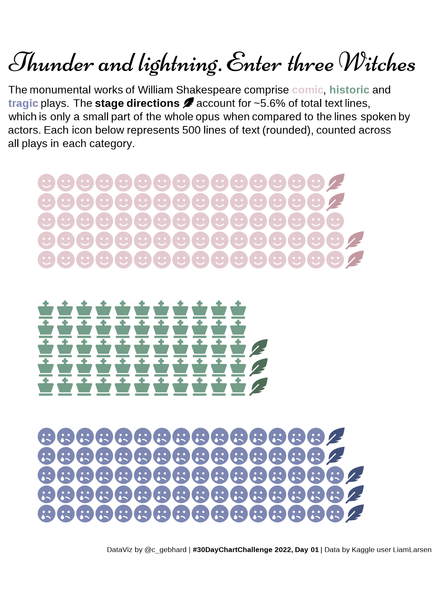

```{r setup, include=FALSE}
knitr::opts_chunk$set(echo = FALSE, 
                      collapse = FALSE,
                      comment = "#>",
                      fig.retina = 2, # Control using dpi
                      fig.width = 6,  # generated images
                      fig.align = "center",
                      dpi = 72, 
                      out.width = "100%",
                      dev = "png",
                      dev.args = list(png = list(type = "cairo-png")),
                      optipng = "-o1 -quiet")

xaringanExtra::use_panelset()

```

```{r xaringanExtra-clipboard, include=FALSE}
htmltools::tagList(
  xaringanExtra::use_clipboard(
    button_text = "<i class=\"fa fa-clipboard\" style=\"color: #394755\"></i>",
    success_text = "<i class=\"fa fa-check\" style=\"color: #1BC7DC\"></i>",
  ),
  rmarkdown::html_dependency_font_awesome()
)
```

## The Challenge

The #30DayChartChallenge is a data visualization community project on Twitter, that was first initialized in 2021 and returned for a second instance in April 2022. The idea is simple: each day in April is given a certain motto or prompt. Participants contribute one data visualization for each day, that should somehow incorporate the given motto.

This year's prompts were as follows:


This year I managed to contribute 21 visualizations that I will post below. The code can be found at my [github repo](https://github.com/nucleic-acid/30DayChartChallenge_2022).

## Comparisons

### Day 01: part-to-whole



